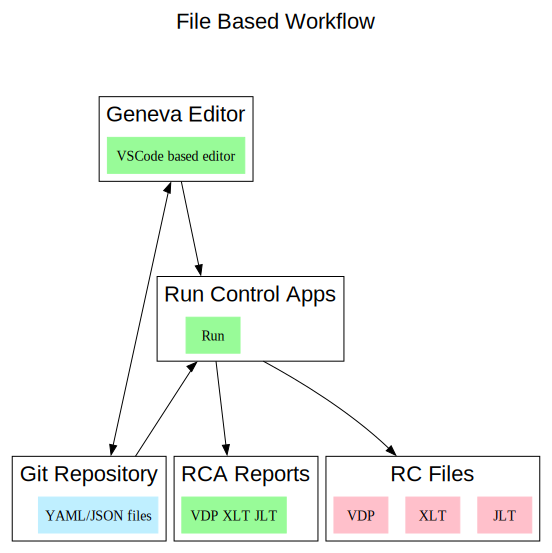

# None Database Version of GenevaERS
GenevaERS has been reliant upon a database to store its meta data and view descriptions.  
A proposal is that we move away from that to using file based definitions.  
The files can then be managed in a git repository like any other source code. Thus providing an audit trail.

## Description
The proposal is to discard the existing Eclipse based workbench in favour of using a VSCode based extension which to provide a smooth user experience.  
Using VSCode we can harness its git and its extensive text editing features.  
As a backend we can call a version of the existing Run Control Apps to verify views and passes.  
The general workflow is captured in the diagram below.  

The same Run Control Apps can then be used on the mainframe to generate the RC Files required by the performance engine.  

In that past we have discussed replacing the existing VDP. XLT and JLT files with a single dedicated file that provides the data needed by the performance engine.  
Developing that may also be an option.

## Development Tasks

### Code Generation

### Migrating Existing Metadata